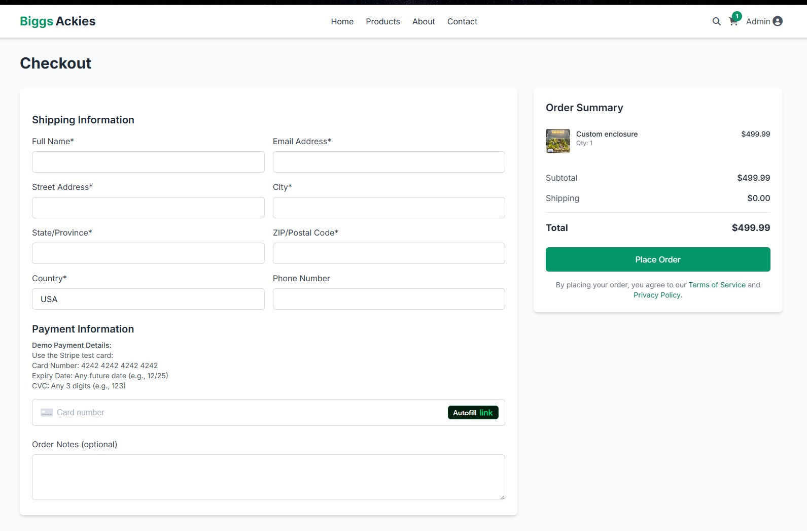
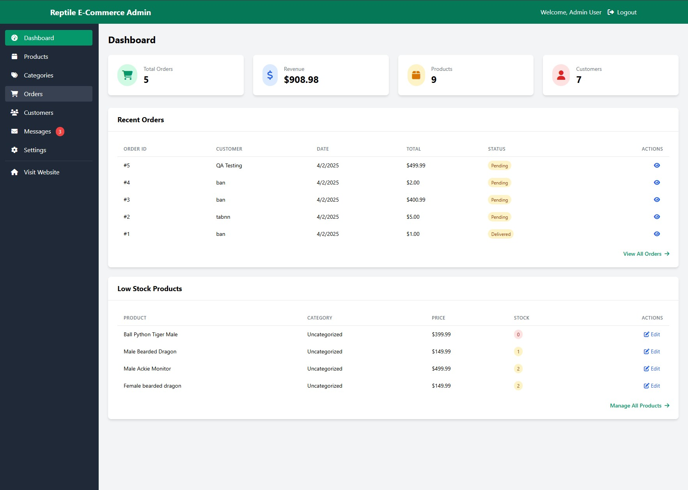

# Reptile E-commerce Platform

[](https://opensource.org/licenses/MIT) <!-- TODO: Update if license is different -->

E-commerce platform for reptiles and supplies.

## Table of Contents

*   [About the Project](#about-the-project)
    *   [Built With](#built-with)
*   [Features Showcase](#features-showcase)
*   [Getting Started](#getting-started)
    *   [Prerequisites](#prerequisites)
    *   [Installation](#installation)
*   [Usage](#usage)
*   [Environment Variables](#environment-variables)
*   [Contributing](#contributing)
*   [License](#license)
*   [Contact](#contact)

## About The Project

This project is an e-commerce platform focused on selling reptiles and related supplies. It provides features for browsing products, user authentication, managing carts, processing payments, and potentially more.

### Built With

This project utilizes the following core technologies:

*   **Backend:**
    *   [Node.js](https://nodejs.org/) (v18.x)
    *   [Express.js](https://expressjs.com/)
    *   [PostgreSQL](https://www.postgresql.org/)
*   **Frontend:**
    *   [EJS (Embedded JavaScript templates)](https://ejs.co/)
    *   [Tailwind CSS](https://tailwindcss.com/)
*   **Key Libraries:**
    *   `bcrypt`: Password Hashing
    *   `cloudinary`: Image/Video Management
    *   `connect-pg-simple`: PostgreSQL Session Store
    *   `cookie-parser`, `express-session`, `csurf`: Session Management & Security
    *   `dotenv`: Environment Variable Management
    *   `helmet`: HTTP Header Security
    *   `multer`: File Upload Handling
    *   `nodemailer`: Email Sending
    *   `pg`: PostgreSQL Client
    *   `socket.io`: Real-time Communication
    *   `stripe`: Payment Processing
    *   `uuid`: UUID Generation

## Features Showcase

Here's a glimpse of the platform's key features:

**Homepage:**

*The main landing page showcasing featured products or categories.*

**Product Listings:**

*Browse the available reptile products with images and details.*

**Shopping Cart:**

*Review items added to the cart before proceeding to checkout.*

**Checkout Process:**

*Secure checkout page for entering shipping and payment information.*

**Contact Form:**

*A dedicated page for users to send inquiries or feedback.*

**Admin Dashboard:**

*Overview dashboard for administrators to monitor site activity.*

**Product Management (Admin):**

*Admin interface for adding, editing, or removing products.*

**Order Management (Admin):**

*Admin view for managing customer orders.*

## Getting Started

To get a local copy up and running, follow these simple steps.

<details>
<summary>Prerequisites</summary>

Make sure you have the following installed on your system:

*   **Node.js:** Version 18.x is required. You can download it from [nodejs.org](https://nodejs.org/).
    ```sh
    node -v
    ```
*   **npm:** (Node Package Manager) Usually comes with Node.js.
    ```sh
    npm -v
    ```
*   **PostgreSQL:** A running instance of PostgreSQL database.

</details>

<details>
<summary>Installation</summary>

1.  **Clone the repo:**
    ```sh
    git clone https://github.com/Tanner253/reptile-ecommerce.git # TODO: Update with actual repo URL
    cd reptile-ecommerce
    ```
2.  **Install NPM packages:**
    ```sh
    npm install
    ```
3.  **Set up Environment Variables:**
    *   Create a `.env` file in the root directory.
    *   Copy the contents of `.env.example` (if available) or add the necessary variables. You will need to configure database connection details, API keys (Stripe, Cloudinary, etc.), session secrets, and other sensitive information. See the [Environment Variables](#environment-variables) section for more details.
    ```sh
    cp .env.example .env # If .env.example exists
    # Then edit .env with your specific configurations
    ```
4.  **Database Setup:**
    *   Ensure your PostgreSQL server is running.
    *   Connect to your PostgreSQL instance and create the database specified in your `.env` file.
    *   (Optional) Run any database migration or seeding scripts if provided. The `reset-db.js` file might be relevant here, but review its functionality first.
    ```sh
    # Example using psql
    # psql -U your_postgres_user -c "CREATE DATABASE your_db_name;"
    # node reset-db.js # Review this script before running!
    ```
5.  **Build CSS:**
    Tailwind CSS needs to be compiled.
    ```sh
    npm run build:css
    ```

</details>

## Usage

*   **Development Mode:**
    This command starts the server using `nodemon`, which automatically restarts the server upon file changes. It also watches for CSS changes.
    ```sh
    npm run dev
    # In a separate terminal, if you want continuous CSS watching:
    # npm run watch:css
    ```
*   **Production Mode:**
    This command starts the server using `node`. Ensure your CSS is built first.
    ```sh
    npm run build:css
    npm start
    ```

Access the application by navigating to `http://localhost:PORT` in your web browser (replace `PORT` with the port number specified in your `.env` file or the application default, often 3000 or 5000).

## Environment Variables

This project relies on environment variables for configuration. Create a `.env` file in the root directory and define the following variables (refer to `.env.example` if it exists, or the source code for required variables):

*   `DATABASE_URL` or individual `DB_HOST`, `DB_PORT`, `DB_USER`, `DB_PASSWORD`, `DB_NAME`
*   `SESSION_SECRET`
*   `PORT`
*   `NODE_ENV` (e.g., `development`, `production`)
*   `CLOUDINARY_CLOUD_NAME`, `CLOUDINARY_API_KEY`, `CLOUDINARY_API_SECRET`
*   `STRIPE_SECRET_KEY`, `STRIPE_PUBLIC_KEY`
*   `EMAIL_HOST`, `EMAIL_PORT`, `EMAIL_USER`, `EMAIL_PASS` (for Nodemailer)
*   ... any other required variables.

**Important:** Never commit your `.env` file to version control. Ensure it is listed in your `.gitignore` file.

## Contributing

Contributions are what make the open-source community such an amazing place to learn, inspire, and create. Any contributions you make are **greatly appreciated**.

<!-- TODO: Add contribution guidelines -->
1.  Fork the Project
2.  Create your Feature Branch (`git checkout -b feature/AmazingFeature`)
3.  Commit your Changes (`git commit -m 'Add some AmazingFeature'`)
4.  Push to the Branch (`git push origin feature/AmazingFeature`)
5.  Open a Pull Request

## License

Distributed under the MIT License. See `LICENSE` file for more information.
<!-- TODO: Verify license -->


Project Link: [https://github.com/your_username/reptile-ecommerce](https://github.com/your_username/reptile-ecommerce) <!-- TODO: Update with actual repo URL --> 